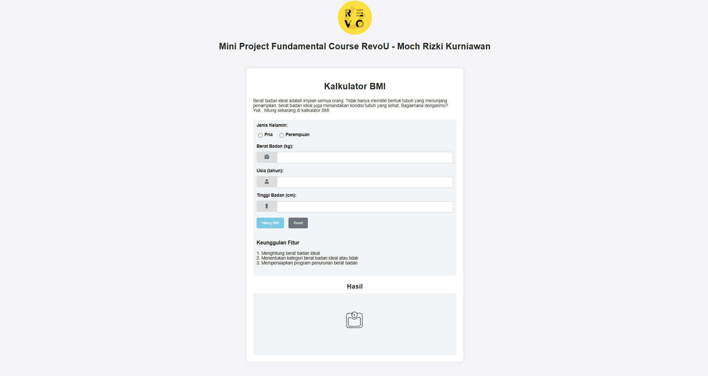

# Kalkulator BMI



Aplikasi kalkulator Body Mass Index (BMI) sederhana yang dibuat menggunakan HTML, CSS, dan JavaScript. Aplikasi ini memungkinkan pengguna untuk memasukkan tinggi dan berat badan mereka untuk menghitung BMI dan menentukan kategori berat badan mereka.

## Daftar Isi

- [Fitur](#fitur)
- [Teknologi](#teknologi)
- [Memulai](#memulai)
- [Penggunaan](#penggunaan)
- [Berkontribusi](#berkontribusi)
- [Lisensi](#lisensi)

## Fitur

- Desain responsif
- Antarmuka yang ramah pengguna
- Perhitungan BMI secara real-time
- Indikasi yang jelas dari kategori BMI

## Teknologi

- HTML
- CSS
- JavaScript

## Memulai

Untuk mendapatkan salinan lokal dan menjalankannya, ikuti langkah-langkah sederhana ini.

### Prasyarat

Anda hanya memerlukan browser web untuk menjalankan proyek ini.

### Instalasi

1. Clone repo
    ```sh
    git clone https://github.com/revou-fundamental-course/8-jul-24-Mochrks.git
    ```

2. Buka `index.html` di browser web Anda.

## Penggunaan

1. Buka aplikasi di browser web Anda.
2. Masukkan Jenis Kelamin
3. Masukkan tinggi badan Anda dalam sentimeter.
4. Masukkan berat badan Anda dalam kilogram.
5. Klik tombol "Hitung BMI".
6. Lihat BMI dan kategori berat badan Anda.
7. Klik tombil " Reset" untuk clear data

## Berkontribusi

Kontribusi membuat komunitas open source menjadi tempat yang luar biasa untuk belajar, menginspirasi, dan menciptakan. Kontribusi apa pun yang Anda buat sangat dihargai.

1. Fork proyek ini
2. Buat Branch Fitur Anda (`git checkout -b fitur/FiturLainnya`)
3. Commit perubahan Anda (`git commit -m 'Tambahkan FiturLainnya'`)
4. Push ke Branch (`git push origin fitur/FiturLainnya`)
5. Buka Pull Request

## Lisensi

Didistribusikan di bawah Lisensi MIT. Lihat `LICENSE` untuk informasi lebih lanjut.

Tautan Proyek: [https://github.com/revou-fundamental-course/8-jul-24-Mochrks](https://github.com/revou-fundamental-course/8-jul-24-Mochrks)
